# MateCode Task Manager

Aplicación web de gestión de tareas desarrollada como Proyecto Integrador del Módulo 4 de Soy Henry. Permite registrarse, iniciar sesión, crear y administrar tareas personales con sincronización en tiempo real, y recibir un resumen por email.

**URL de producción:** https://proyecto-m4-gerardo-acosta.vercel.app

---

## Stack tecnológico

- **Frontend:** React 19 + TypeScript + Vite
- **Autenticación y base de datos:** Firebase Authentication + Firestore
- **Email:** AWS SES vía Vercel Function (serverless)
- **Testing:** Vitest + React Testing Library
- **Deploy:** Vercel

---

## Funcionalidades

- Registro y login con **email/password** y **Google**
- Recuperación de contraseña por email (con opción de reenvío si no llegó)
- Logout y sesión persistente (sobrevive recarga del navegador)
- Rutas protegidas: las tareas son inaccesibles sin sesión activa
- **CRUD completo de tareas:** crear, editar, eliminar y marcar como completada
- **Campos opcionales:** prioridad (baja / media / alta) y fecha de vencimiento
- **Filtros:** todas / pendientes / completadas
- **Dos vistas:** Lista y Solapa
- **Selección múltiple:** modo selección para eliminar varias tareas a la vez
- **Soft-delete con Deshacer:** al eliminar, tenés 5 segundos para revertir la acción antes de que se confirme el borrado en Firestore
- **Gestos táctiles (mobile):** deslizá una tarea a la derecha para completarla o a la izquierda para eliminarla. En modo selección, tocá cualquier tarea para marcarla para borrar.
- Sincronización en tiempo real con `onSnapshot` — la UI se actualiza sin recargar
- Cada usuario ve solo sus propias tareas (aislamiento por `userId`)
- Envío de resumen personalizado de tareas por email (pendientes y completadas)
- **Tema claro/oscuro** persistido en localStorage
- **Diseño responsive** para mobile y tablets

---

## Capturas de pantalla

> Login y Register mantienen tema fijo claro — el toggle de tema no está disponible en esas pantallas.

### Escritorio

**Login**
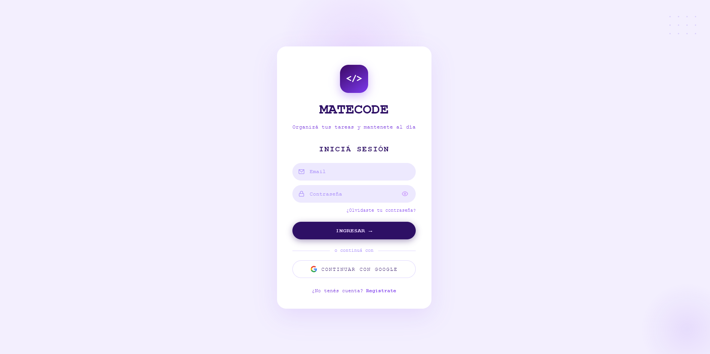

**Register**
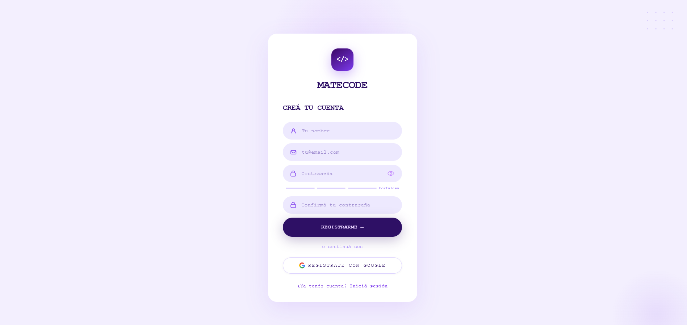

**Tasks — Lista (dark)**
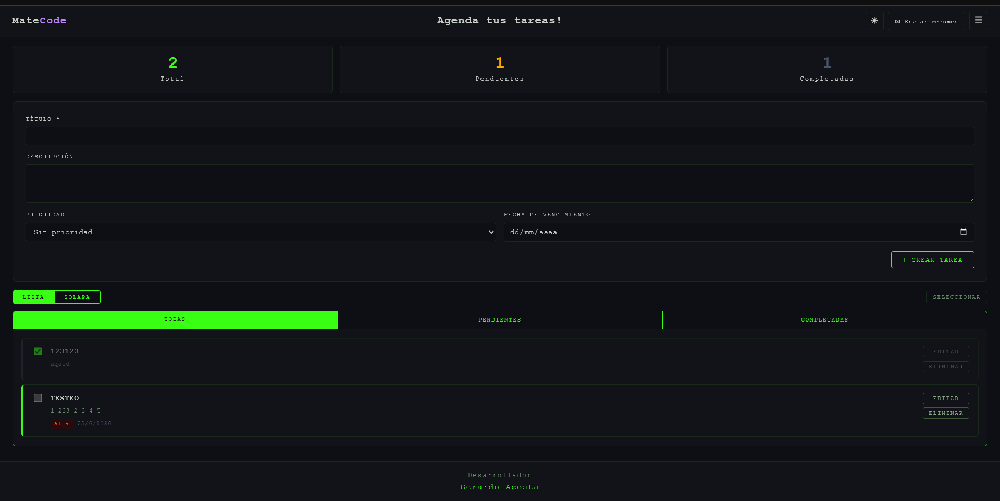

**Tasks — Lista (light)**
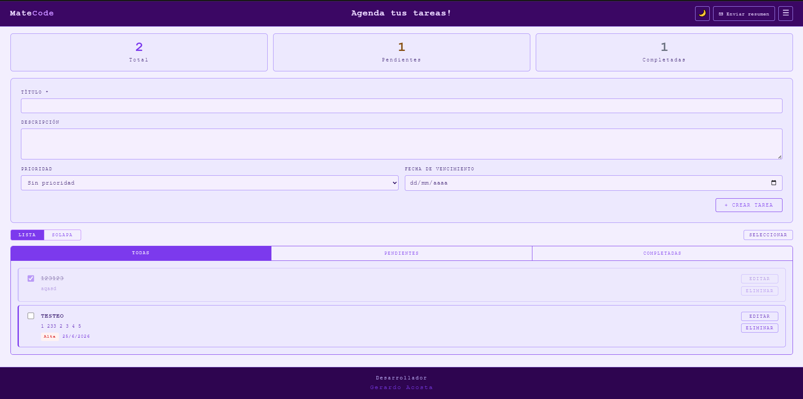

**Tasks — Solapa (dark)**
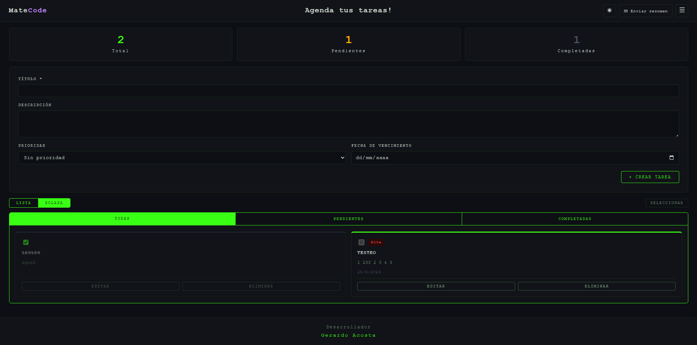

**Tasks — Solapa (light)**
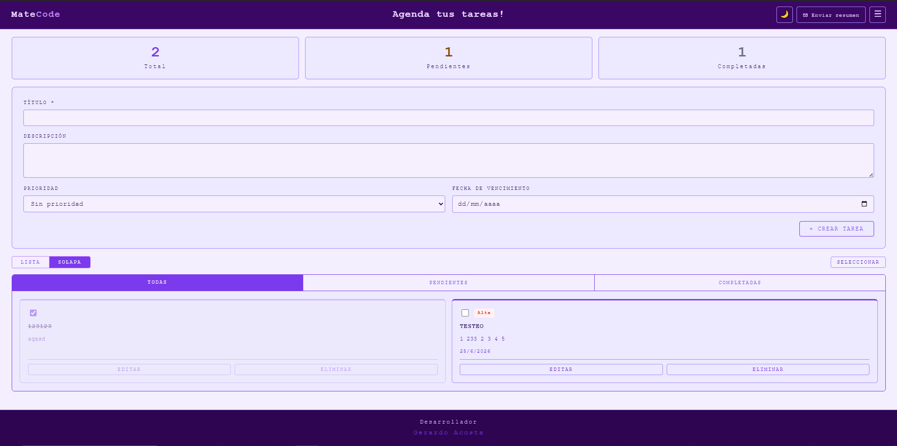

### Mobile

**Login**
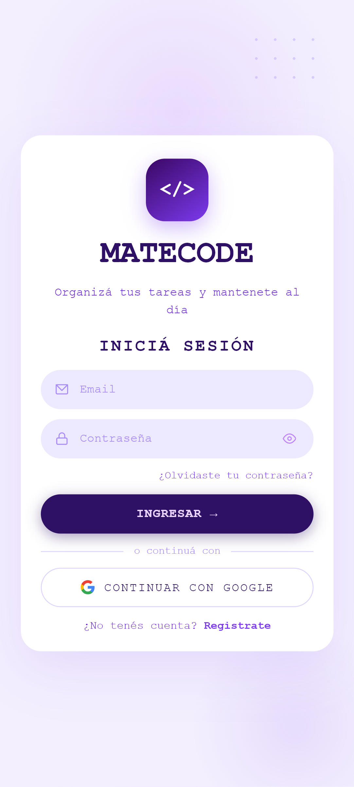

**Register**
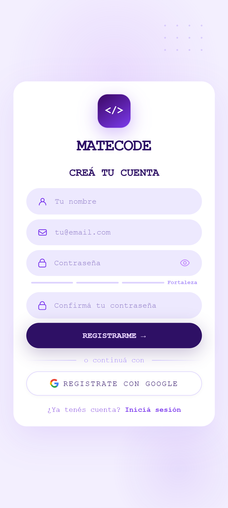

**Tasks — Lista (dark)**
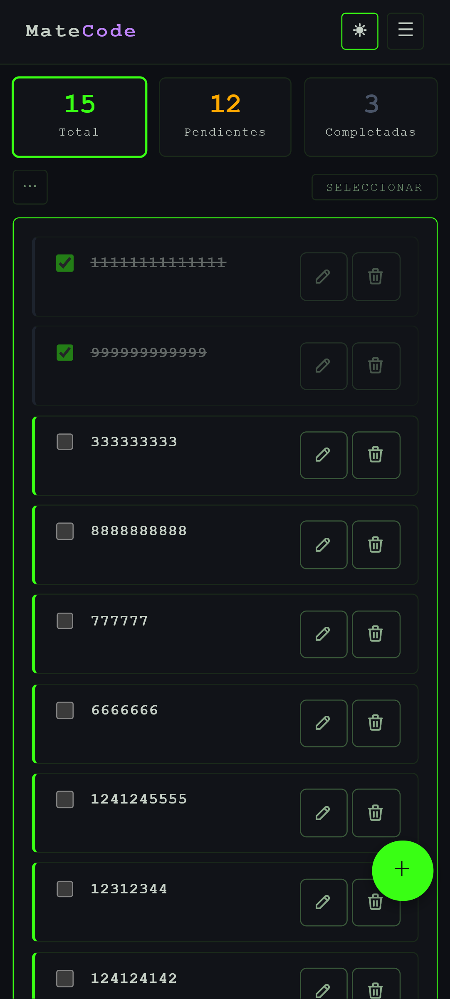

**Tasks — Lista (light)**
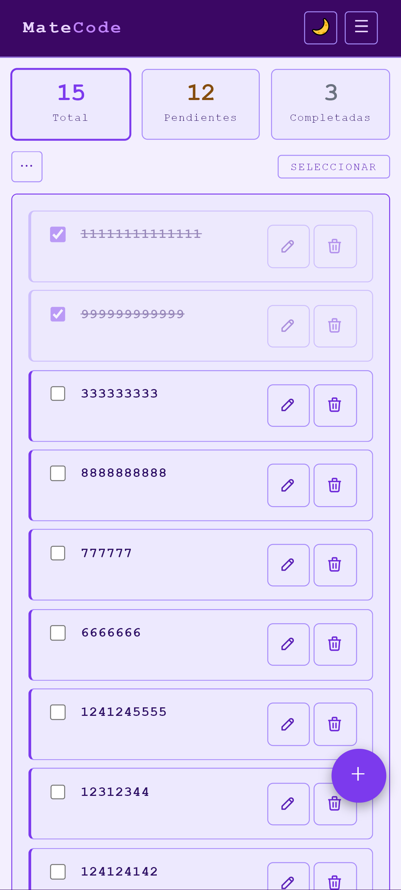

**Tasks — Solapa (dark)**
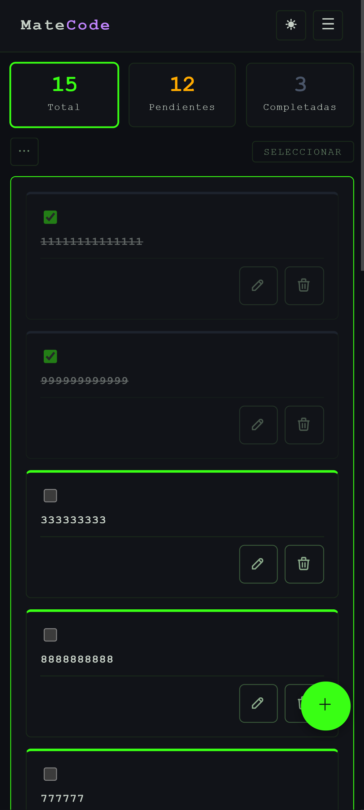

**Tasks — Solapa (light)**
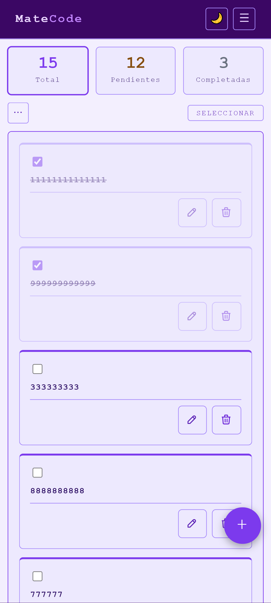

---

## Decisiones de arquitectura

### Estructura de carpetas

```
ProyectoM4_Gerardo-Acosta/
├── src/
│   ├── assets/
│   │   └── screenshots/    # Capturas de la app por viewport y tema
│   ├── components/     # Componentes UI reutilizables
│   ├── constants/      # Strings centralizados (messages.ts)
│   ├── features/       # Lógica por dominio: auth/ (AuthContext, AuthProvider)
│   ├── hooks/          # useAuth, useTasks, useTheme, useIsMobile, useSwipeToAction
│   ├── pages/          # Login, Register, ForgotPassword, Tasks
│   ├── routes/         # AppRouter, ProtectedRoute, PublicOnlyRoute
│   ├── services/       # firebase.ts, firestoreService.ts, emailService.ts, authService.ts
│   ├── styles/         # Variables CSS globales y tema
│   ├── types/          # Interfaces compartidas (Task, TaskFormValues, etc.)
│   ├── utils/          # Helpers: validaciones, formateo, errores Firebase
│   ├── App.tsx
│   └── main.tsx
├── api/                # Vercel Functions: send-email.ts
├── public/             # Estáticos públicos
├── tests/              # Tests unitarios y de componentes
├── firestore.rules     # Reglas de seguridad de Firestore
├── firestore.indexes.json
└── vercel.json         # Rewrite SPA + configuración de deploy
```

### Separación de responsabilidades

El proyecto sigue un modelo de capas estricto:

| Capa | Responsabilidad |
|---|---|
| `src/components/` | UI pura, recibe datos y callbacks por props |
| `src/hooks/` | Estado y efectos secundarios (`useTasks`, `useAuth`) |
| `src/services/` | Llamadas a Firebase y al endpoint de email |
| `api/` | Lógica serverless (nunca se ejecuta en el navegador) |

Los componentes no importan Firebase directamente. Toda la lógica de Firestore está encapsulada en `firestoreService.ts` y consumida a través de `useTasks`.

### Seguridad de credenciales

Las variables de Firebase llevan el prefijo `VITE_` para que Vite las incluya en el bundle del cliente. Las credenciales de AWS **no tienen ese prefijo**: solo existen en el entorno de la Vercel Function y nunca llegan al navegador.

### Sincronización en tiempo real

`useTasks` abre una suscripción con `onSnapshot` al montar el componente y la cancela en el cleanup del `useEffect`. Esto evita memory leaks si el usuario cierra sesión o navega a otra ruta.

### Campos opcionales en Firestore

Firestore rechaza valores `undefined`. Los campos opcionales (`priority`, `dueDate`) se agregan al documento de forma condicional, solo cuando el usuario los proveyó, evitando errores silenciosos.

### Routing SPA en Vercel

`react-router-dom` usa `BrowserRouter`. Para que Vercel no devuelva 404 en accesos directos a rutas como `/tasks`, el archivo `vercel.json` define un rewrite que redirige todo el tráfico que no sea `/api/*` a `index.html`, donde React Router toma el control.

### Reglas de seguridad de Firestore

Las reglas en `firestore.rules` validan en el servidor que:
- El usuario esté autenticado (`request.auth != null`)
- Para lectura/escritura: `request.auth.uid == resource.data.userId`
- Para creación: `request.auth.uid == request.resource.data.userId`

Esto garantiza que ningún usuario pueda leer ni modificar las tareas de otro, independientemente del código del cliente.

---

## Flujo de envío de email

1. El usuario hace click en "Enviar resumen por email" en la página de tareas.
2. El frontend llama a `/api/send-email` con `{ to, summary: { pending, completed } }`.
3. La Vercel Function valida el payload y llama a AWS SES con las credenciales del entorno del servidor.
4. SES envía el email desde la dirección configurada en `SES_FROM_EMAIL`.
5. La UI muestra feedback de éxito o error según la respuesta.

El frontend **nunca** llama a AWS directamente. Las credenciales AWS no existen en el bundle del cliente.

> AWS SES en modo sandbox solo puede enviar a direcciones de email verificadas en la consola de AWS.

---

## Instalación local

### Requisitos

- Node.js 18+
- Cuenta de Firebase con un proyecto creado
- Cuenta de AWS con SES configurado (al menos un email verificado en sandbox)
- Vercel CLI (opcional, para probar las funciones serverless localmente)

### Pasos

```bash
# 1. Clonar el repositorio
git clone <URL-del-repo>
cd ProyectoM4_Gerardo-Acosta

# 2. Instalar dependencias
npm install

# 3. Configurar variables de entorno
cp .env.example .env
# Editar .env con los valores reales

# 4. Correr en desarrollo
npm run dev

# 5. Para probar el endpoint de email localmente
vercel dev
```

### Correr tests

```bash
npm run test
```

27 tests en 4 suites (firestoreService, TaskForm, TaskList, SendSummaryButton). Firebase está completamente mockeado — no se hacen llamadas reales.

---

## Variables de entorno

Copiar `.env.example` a `.env` y completar con los valores reales.

```env
# Firebase — prefijo VITE_ obligatorio (Vite las expone al cliente)
VITE_FIREBASE_API_KEY=
VITE_FIREBASE_AUTH_DOMAIN=
VITE_FIREBASE_PROJECT_ID=
VITE_FIREBASE_STORAGE_BUCKET=
VITE_FIREBASE_MESSAGING_SENDER_ID=
VITE_FIREBASE_APP_ID=

# AWS SES — SIN prefijo VITE_ (solo serverless, nunca al cliente)
AWS_ACCESS_KEY_ID=
AWS_SECRET_ACCESS_KEY=
AWS_REGION=
SES_FROM_EMAIL=
```

En Vercel, cargar las mismas variables en **Settings → Environment Variables**. Las variables `VITE_*` aplican al build del frontend; las de AWS aplican a las Vercel Functions.

---

## Integración de IA en el proceso de desarrollo

Durante el desarrollo de MateCode adopté un workflow de dos instancias de IA con roles diferenciados: Claude (claude.ai) como arquitecto y asesor de decisiones, y Claude Code como implementador dentro del editor. Esta separación resultó clave para mantener la calidad del código sin perder velocidad.

**Dónde la IA fue más efectiva:**

- **Planificación y diseño:** antes de escribir una sola línea de código, Claude y yo definíamos el plan completo — decisiones de arquitectura, estructura de componentes, flujo de datos. Esto evitó refactorizaciones costosas a mitad del desarrollo.
- **Toma de decisiones arquitectónicas:** desde la elección de patrones (Context API vs prop drilling, subcollection vs campo userId en Firestore) hasta trade-offs de CSS (grid vs flexbox en el header responsive), la IA funcionó como un segundo criterio técnico para validar o desafiar mis ideas.
- **Debugging:** en errores de especificidad CSS, timing de Firebase, o conflictos entre gestos touch y eventos de click, la IA aceleró notablemente el diagnóstico al conectar síntomas con causas no evidentes.
- **Boilerplate:** configuración de Vitest, estructura inicial de hooks, tipos de TypeScript repetitivos — tareas donde la IA eliminó fricción sin comprometer decisiones de diseño.

**Patrones y buenas prácticas adoptadas:**

- **Separación de roles:** Claude (claude.ai) diseña, Claude Code implementa. Nunca le pedía a Claude Code que tomara decisiones de arquitectura, ni usaba claude.ai para escribir código directamente. Esta separación mantuvo la coherencia del proyecto.
- **Plan cerrado antes de implementar:** ningún feature arrancaba sin un spec completo acordado. Esto redujo drásticamente los cambios de rumbo a mitad de implementación.
- **Verificación visual antes de cada commit:** cada paso se verificaba en el navegador / localhost antes de commitear. Nunca se acumulaban cambios sin revisar. Esto permitió detectar regresiones de inmediato y mantener commits limpios.

**Limitaciones y fricciones:**

- **Pérdida de contexto en conversaciones largas:** en sesiones extensas la IA podía perder detalles de decisiones tomadas al principio. Se mitigó con un CLAUDE.md actualizado que funcionaba como fuente de verdad del proyecto.
- **Ambigüedad en los pedidos:** cuando una instrucción era imprecisa, la IA asumía interpretaciones que no siempre coincidían con la intención real. La solución fue aprender a especificar con más detalle, incluyendo qué no debía tocarse (ej: "desktop intocable, solo cambios en @media (max-width: 600px)").
- **Código correcto pero fuera de estilo:** ocasionalmente Claude Code generaba soluciones técnicamente válidas pero que no respetaban el estilo o las convenciones del proyecto. El CLAUDE.md con decisiones documentadas fue la herramienta principal para corregir esto.

La IA funcionó como una herramienta de aceleración, no de reemplazo del aprendizaje. Cada tecnología, patrón y decisión de diseño utilizada en el proyecto fue primero comprendida e iterada antes de ser implementada.
